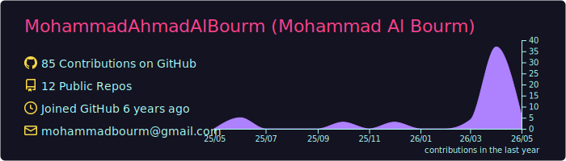
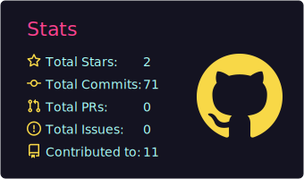
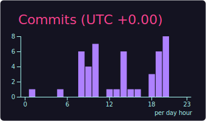
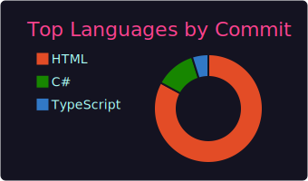
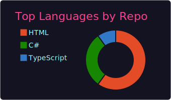

<!-- HEADER -->
<h1 align="center">👋 Hi, I'm Mohammad Al Bourm</h1>
<h3 align="center">Senior Software Engineer | Software Architect | .NET & SaaS Systems Builder</h3>

  

  
  

---

## 🚀 About Me

- 🧠 Senior Software Engineer specializing in scalable system design
- 🏗️ Focused on Clean Architecture, Microservices & SaaS platforms
- 💡 Passionate about turning business ideas into real systems
- 🌍 Experienced in enterprise, government & product-based systems
- ⚡ Always improving architecture, performance & scalability

---

## 🧩 What I Do

✔ Design scalable SaaS systems  
✔ Build enterprise-grade APIs  
✔ Architect microservices ecosystems  
✔ Transform business ideas into software products  
✔ Optimize legacy systems into modern architectures

---

## 🛠️ Tech Stack

### 👨‍💻 Backend

### 🌐 Frontend

### 🗄️ Database

### ⚙️ Dev Tools

---

## 🏗️ Architecture Expertise

- 🧱 Clean Architecture
- 🔗 Microservices Architecture
- 📡 CQRS Pattern
- 📦 Repository & Unit of Work
- 🔐 JWT Authentication & Security Best Practices
- ⚙️ SOLID Principles

---

## 📊 GitHub Stats

<!-- These SVGs are generated daily by the workflow in
     .github/workflows/profile-summary-cards.yml and committed
     to /profile-summary-card-output/. They are static files in
     this repo, so they never break from API rate limits. -->

  

  
  

  
  

### 🔥 Contribution Streak

  

### 🏆 Trophies

  

---

## 🌐 Connect With Me

  
  
  

---

## ⚡ Motto

> "I don't just build software — I design systems that scale."
